# myRaycastExtensions

个人使用的 Raycast 扩展

## 包含的扩展

- myiptools 工具

以下是针对具体工具的介绍。

## myiptools 工具

> [!important] 声明与致谢
> 本扩展的部分功能代码参考了 Raycast 扩展商店中的 ip-tools 扩展。
> [Raycast Store: IP Tools](https://www.raycast.com/meguoe/ip-tools)

包含以下功能：

- IP 地址计算器
- IP 转数值
- 数值转 IP
- IPv6 地址的压缩与扩展
- 将 IPv4 地址转换成IPv6格式
- 掩码计算器
- 显示当前 IP 地址
- 查询 IPv4 或 IPv6 地址的位置信息

### 安装方法

安装前，请提前注册一个 Raycast 账号，开启 Raycast 的开发者模式。

目前该扩展仅作为个人使用，暂未考虑上架 Raycast 官方扩展商店，只能通过以下开发者模式的方法进行安装。

1. 克隆该项目到本地任意位置。

2. 打开 Raycast 输入命令 `Import Extension`，选择 myiptools 扩展的根目录。

    > [!NOTE]
    >
    > 例如，我这里将 myRaycastExtensions 项目克隆到了 `/User/zhangsan/Github/` 目录中，导入的 myiptools 工具的时候就选择 `/Users/zhangsan/Github/myRaycastExtensions/myiptools` 目录。

3. 打开终端, 移动到 对应扩展(myiptools) 的根目录路径下执行

    ```bash
    cd /Users/zhangsan/Github/myRaycastExtensions/myiptools/
    # 请提前安装 npm 
    npm install
    npm run dev
    ```

此时对应扩展的命令应该已经可以在 Raycast 内运行.

### 功能介绍

1. IP 地址计算器

   - **IPv4**：计算当前网段内「IP 地址总数」、「CIDR掩码」、「可用 IP 数」、「子网掩码」、「网络地址」、「广播地址」、「第一个可用主机 IP」、「最后一个可用主机 IP」信息。

   - **IPv6**：计算当前网段内「IP 地址总数」、「第一个可用主机 IP」、「最后一个可用主机 IP」、「前缀长度」信息。

   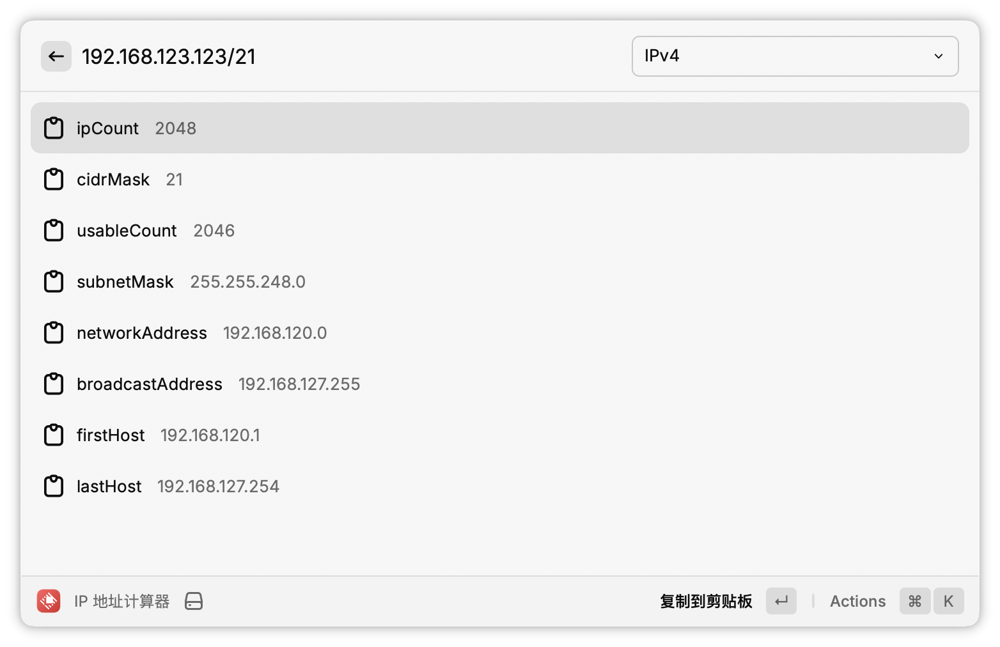
   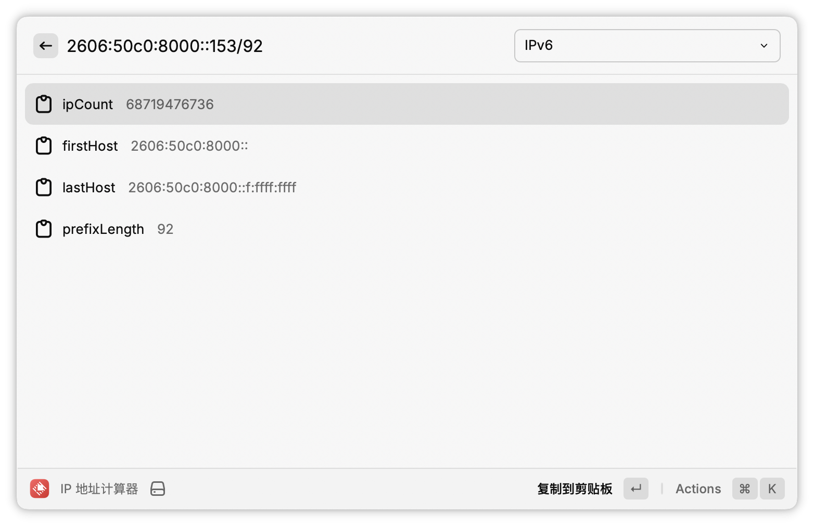

2. IP 转数值

   将 IPv4 或 IPv6 地址转换成二进制、十进制、十六进制的数值。

   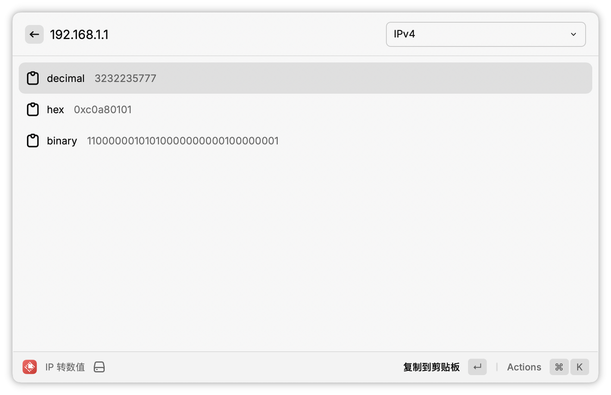
   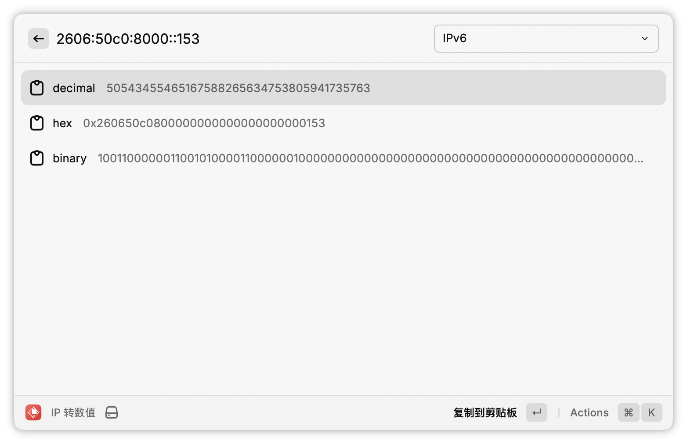

3. 数值转 IP

   上面 IP 转数值的逆过程。
   将二进制、八进制、十进制、十六进制的数值转换为 IPv4 和 IPv6 地址。

   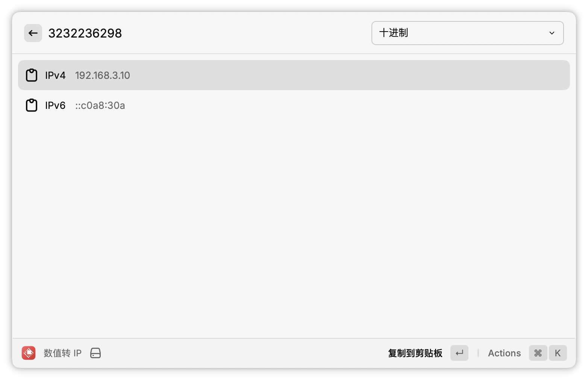
   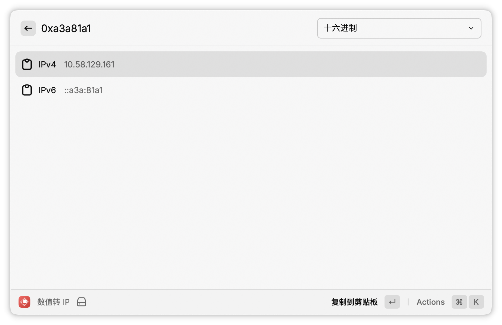

4. IPv6 地址的压缩与扩展

   将 IPv6 地址转换为「简写形式」或「全写形式」。

   IPv6地址由8组16位的十六进制数构成，每组之间用 `:` 分隔。在简写 IPv6 地址时，可以应用以下规则：

   - **省略前导零**：每组中的前导零都可以省略。例如，0008可以简写为8。

   - **双冒号缩写**：连续的零组（两个或更多）可以用双冒号 `::` 来代替。但在一个地址中，双冒号只能使用一次。例如，`2403:A200:A200:1100:0000:0000:0F00:0003` 可以简写为 `2403:A200:A200:1100::F00:3`。

   - **保留单个零**：如果一组数字全为零，且不使用双冒号缩写，那么这组中至少要保留一个零。例如，`2403:A200:A200:0000:AFFF:0000:0000:0003` 可以简写为 `2403:A200:A200:0:AFFF::3`。

   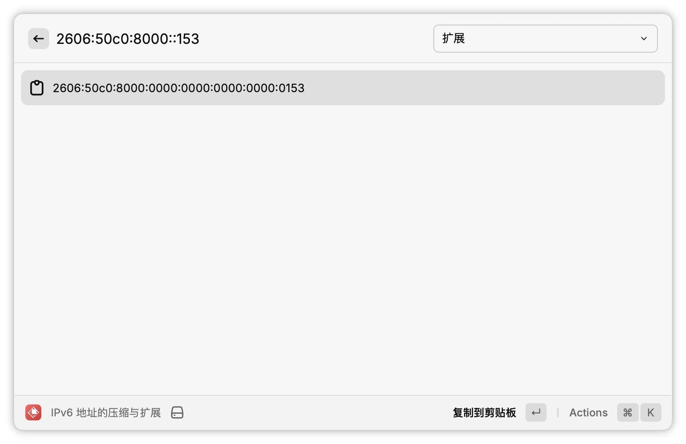
   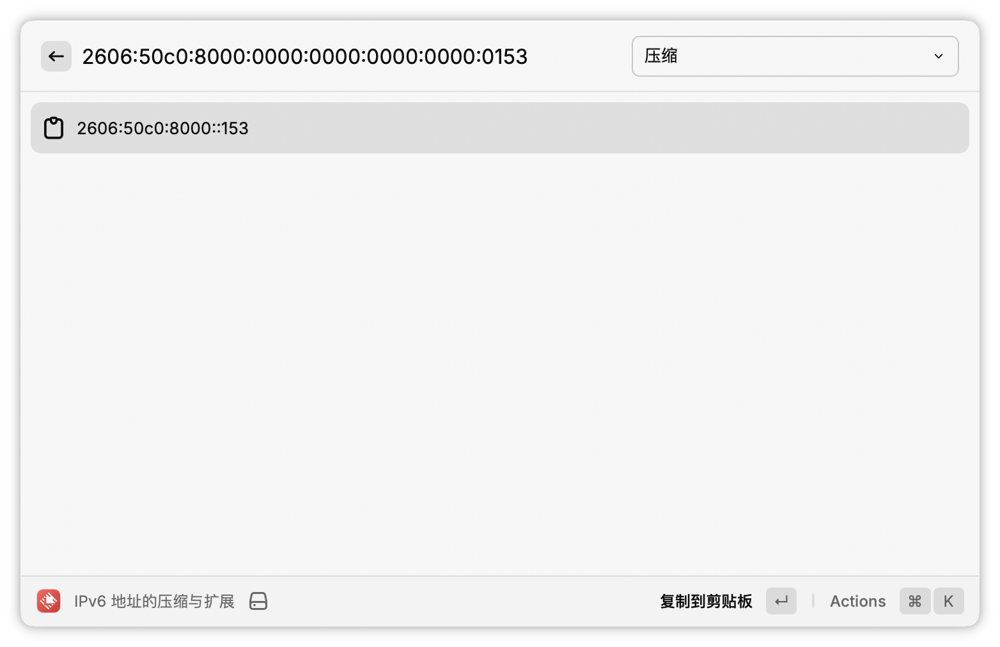

5. 将 IPv4 地址转换成 IPv6 格式

   IPv4 嵌入 IPv6 地址是一种用于实现 IPv4 与 IPv6 互通的技术。通过将 IPv4 地址嵌入到 IPv6 地址中，可以在过渡阶段支持两种协议的兼容性。这种方法主要用于隧道技术和地址映射。

   IPv4 到 IPv6 的转换方法：

   - **非标准转换**：在 IPv4 地址前补充 96 位的 0，例如： `::135.75.43.52`

   - **标准转换**：将 IPv4 地址转换为十六进制后嵌入 IPv6 地址。例如： `::874B:2B34` 其中 `135.75.43.52` 的十六进制表示为`87.4B.2B.34`

   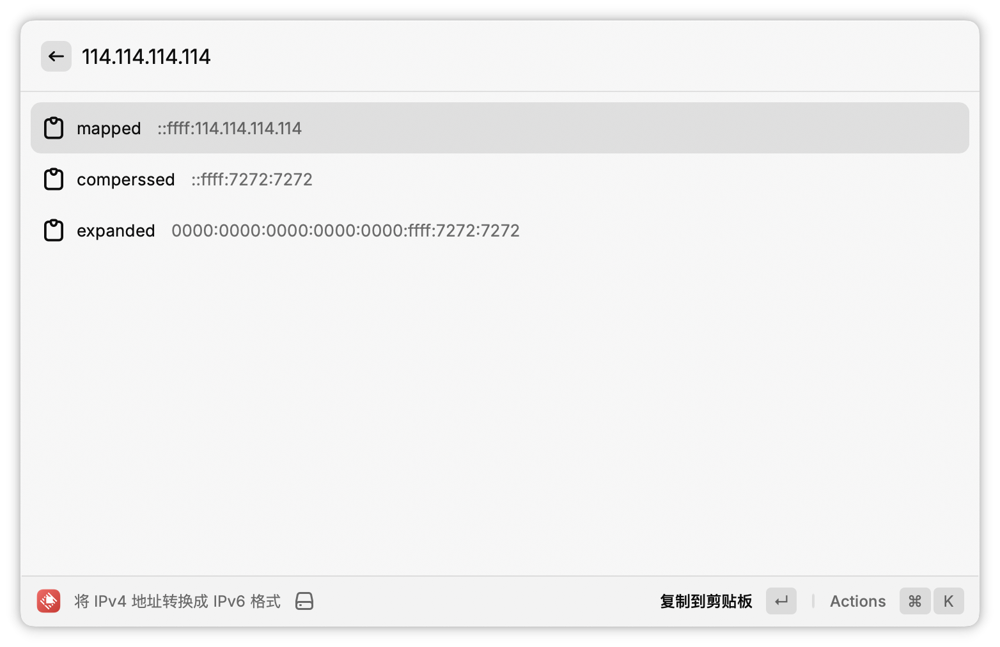

6. 掩码计算器

   CIDR 前缀和子网掩码互转。

   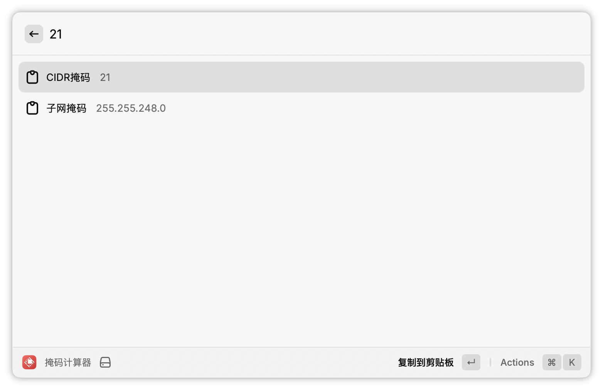
   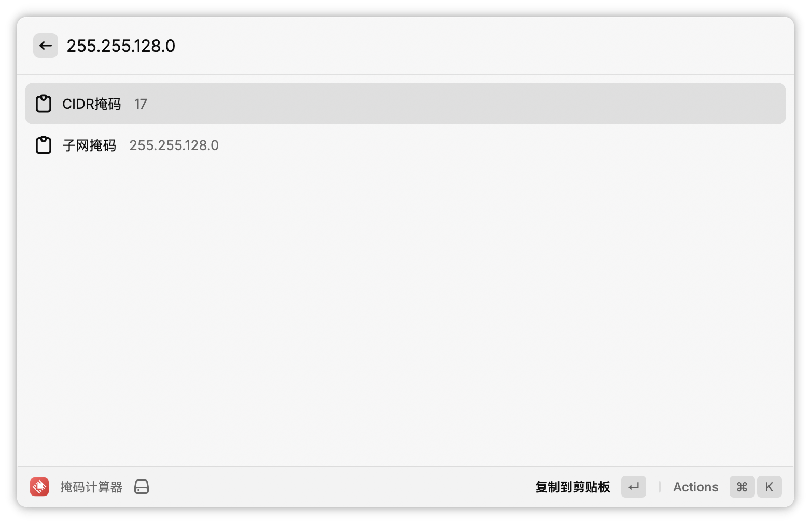

7. 显示当前 IP

   **这里我做了个定制，只显示我电脑上的有线网卡（en6）、无线网卡（en0）和运营商的 IP 地址信息。**

   **每台电脑的情况各有不同，如果用到这个功能的话，可以直接修改一下代码，定制你想显示的网卡信息。**

   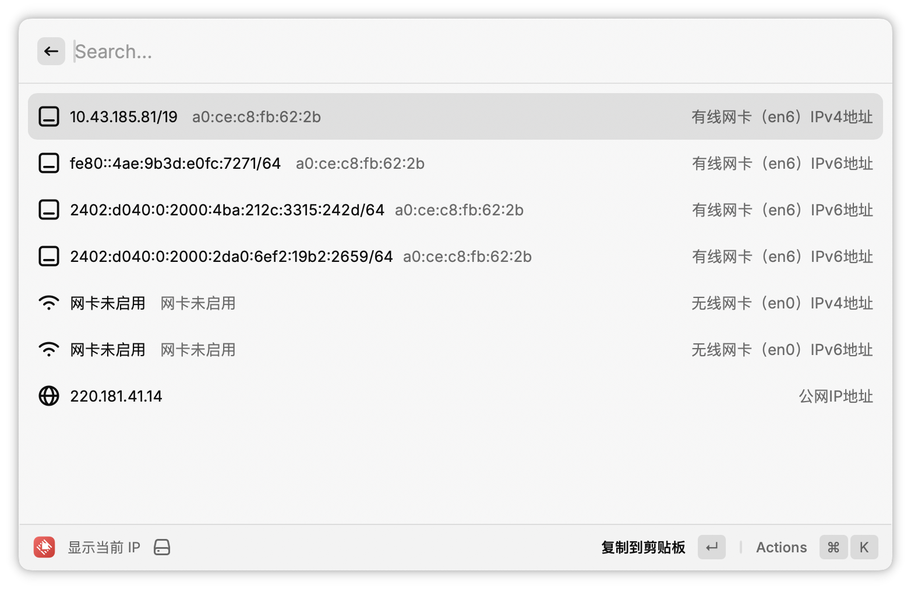

8. 查询 IPv4 或 IPv6 地址的位置信息

   默认什么都不输入的话，是显示当前出口的运营商 IP 的信息。如果输入了 IP 地址则显示输入的 IP 地址的位置信息。

   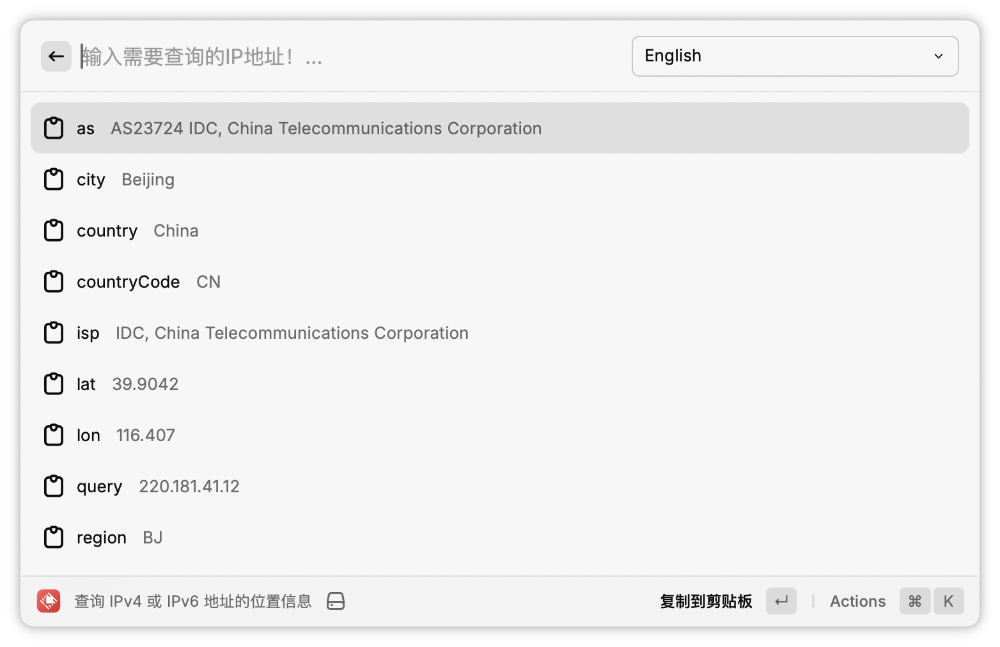
   
   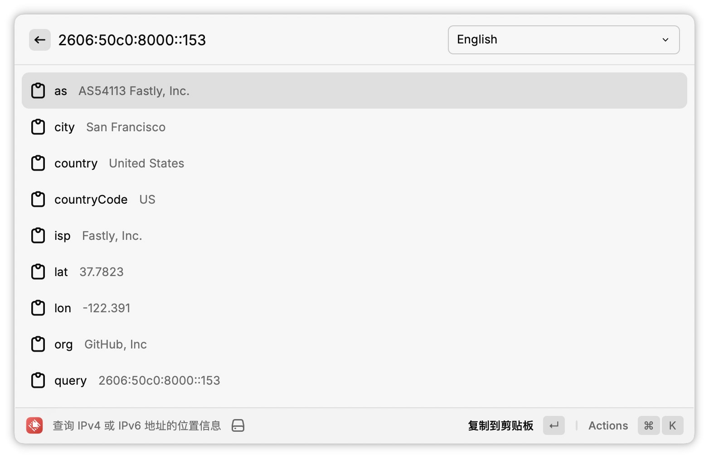
